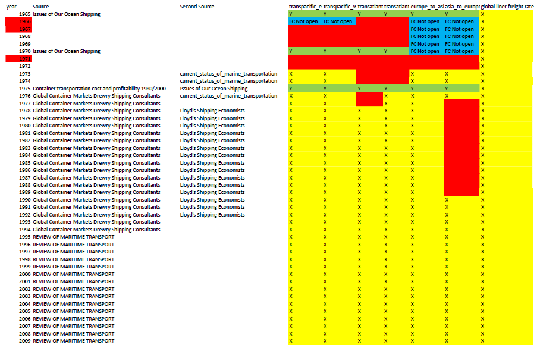
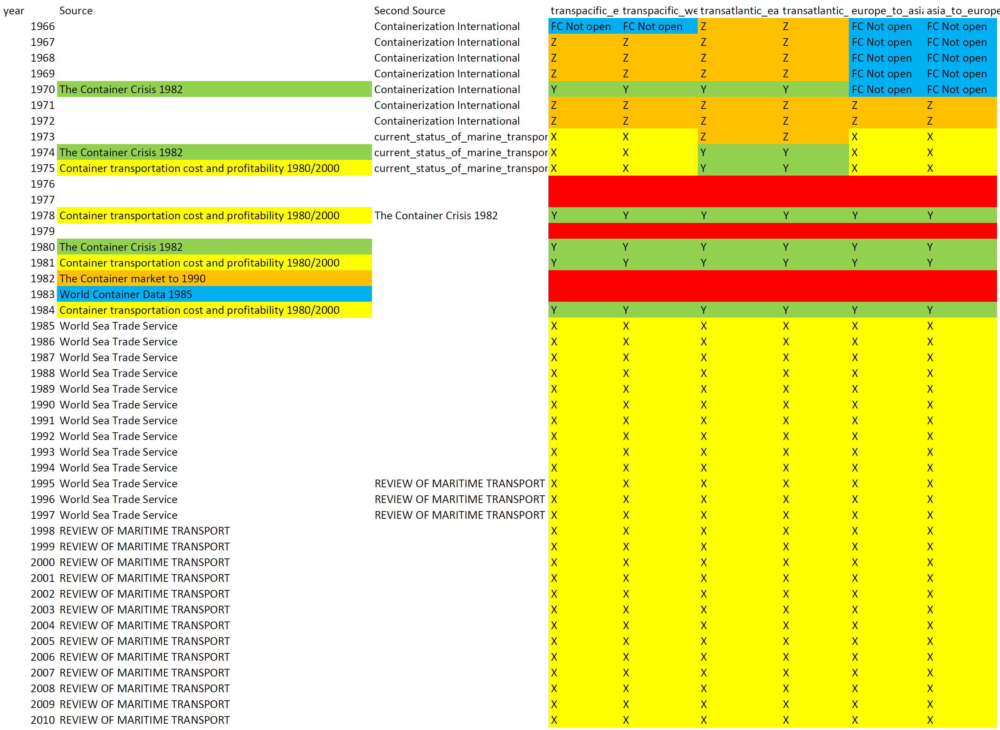

```{r setup, include=FALSE}
knitr::opts_chunk$set(echo = TRUE)
```

# Filled, missing, and imputed data {.tabset}

## Freight rate data

{#id .class width=200mm}

## Shipping quantity data

{#id .class width=200mm}

```{r, include=FALSE}
knitr::opts_chunk$set(echo = FALSE, message = FALSE, warning = FALSE, cache = FALSE)
rm(list = ls())
library(readxl)
library(magrittr)
library(ggplot2)
library(modelsummary)
library(kableExtra)
options("modelsummary_format_numeric_latex" = "plain")

```

# freight rate RAW data {.tabset}

```{r,echo=FALSE,results = 'asis'}
freight_rate_global_container_markets <-
  read_excel("../input/freight_rate_global_container_markets.xlsx") %>%
  tidyr::tibble()
freight_rate_main_routes_review_of_maritime_transport <-
  read_excel("../input/freight_rate_main_routes_review_of_maritime_transport.xlsx") %>%
  tidyr::tibble()
freight_rate_global_review_of_maritime_transport <-
  read_excel("../input/freight_rate_global_review_of_maritime_transport.xlsx") %>%
  tidyr::tibble()
freight_rate_issues_of_our_ocean_shipping <-
  read_excel("../input/freight_rate_issues_of_our_ocean_shipping.xlsx") %>%
  tidyr::tibble()
freight_rate_EUROFE19781989 <-
  read_excel("../input/EUROFE19781989.xlsx") %>%
  tidyr::tibble()
freight_rate_EUROFE19781989 <-
  read_excel("../input/EUROFE19781989.xlsx") %>%
  tidyr::tibble()
freight_revenue_current_status_of_marine_transportation <-
  read_excel("../input/freight_revenue_current_status_of_marine_transportation.xlsx") %>%
  tidyr::tibble()
traffic_amount_current_status_of_marine_transportation <-
  read_excel("../input/traffic_amount_current_status_of_marine_transportation.xlsx") %>%
  tidyr::tibble()
EUROFE19781989 <-
  read_excel("../input/EUROFE19781989.xlsx") %>%
  tidyr::tibble() %>% 
  # dplyr::left_join(cpi_1965_2010_based_on_1995,
  #                  by = c("year" = "year")) %>% 
  dplyr::mutate(europe_to_asia = 
                  `Europe-FE Eastbound`)
d_1965_1994_price_rawdata <-
  readRDS(file = "../cleaned/d_1965_1994_price_rawdata.rds")
```


```{r,echo=FALSE,results = 'asis'}
freight_rate_current_status_of_marine_transportation <-
  freight_revenue_current_status_of_marine_transportation[,1:5]

conversion_ratio_tons_to_TEU = 20 # 20 tons = 1 TEU
# compute freight rate from revenue and quantity
freight_rate_current_status_of_marine_transportation <- 
  cbind(freight_rate_current_status_of_marine_transportation,
        # 291.84 yen = 1 U.S. dollars in 1974
        # 1mil yen per 1000 metric tons => 1000 yen per 1 metric ton
        ((freight_revenue_current_status_of_marine_transportation[,6:11]*1000000/
            (traffic_amount_current_status_of_marine_transportation[,6:11]*1000))*
           conversion_ratio_tons_to_TEU/291.84)
  ) %>% 
  # 1dollars per TEU
  dplyr::mutate(unit = "dollars per TEU") %>% 
  dplyr::select(year,
                `transpacific_eastbound(current_dollars)`,
                `transpacific_westbound(current_dollars)`,
                `transatlantic_eastbound(current_dollars)`,
                `transatlantic_westbound(current_dollars)`,
                `europe_to_asia(current_dollars)`,
                `asia_to_europe(current_dollars)`) %>% 
  dplyr::filter(year >= 1973)
freight_rate_global_container_markets <-
  freight_rate_global_container_markets %>%
  dplyr::filter(is.na(Source) == 0) %>%
  dplyr::select(year,
                `transpacific_eastbound(current_dollars)`,
                `transpacific_westbound(current_dollars)`,
                `transatlantic_eastbound(current_dollars)`,
                `transatlantic_westbound(current_dollars)`,
                `europe_to_asia(current_dollars)`,
                `asia_to_europe(current_dollars)`)
freight_rate_main_routes_review_of_maritime_transport <-
  freight_rate_main_routes_review_of_maritime_transport %>%
  dplyr::filter(is.na(Source) == 0) %>%
  dplyr::select(year,
                `transpacific_eastbound(current_dollars)`,
                `transpacific_westbound(current_dollars)`,
                `transatlantic_eastbound(current_dollars)`,
                `transatlantic_westbound(current_dollars)`,
                `europe_to_asia(current_dollars)`,
                `asia_to_europe(current_dollars)`)
colnames_data_set <-
  c("year",
    "transpacific_eastbound",
    "transpacific_westbound",
    "transatlantic_eastbound",
    "transatlantic_westbound",
    "europe_to_asia",
    "asia_to_europe")
colnames(freight_rate_main_routes_review_of_maritime_transport) <-
  colnames_data_set
colnames(freight_rate_global_container_markets) <-
  colnames_data_set
colnames(freight_rate_current_status_of_marine_transportation) <-
  colnames_data_set
### insert europe_to_asia data from Lloyd's Shipping Economists ----

# compute conversion rate at 1990
EUROFE19781989_conversion_rate_1990 <-
  as.numeric(freight_rate_global_container_markets[
    freight_rate_global_container_markets$year==1990,6]/
      EUROFE19781989[EUROFE19781989$year == 1990,5])
freight_rate_global_container_markets[3:14,6] <-
  EUROFE19781989$europe_to_asia[1:12]*
  EUROFE19781989_conversion_rate_1990
freight_rate_main_routes_review_of_maritime_transport <-
  freight_rate_main_routes_review_of_maritime_transport %>% 
  dplyr::mutate(Source_name = "RMT")
freight_rate_global_container_markets <-
  freight_rate_global_container_markets %>% 
  dplyr::mutate(Source_name = "glo con mkt") %>% 
  dplyr::filter(year >= 1976)
freight_rate_current_status_of_marine_transportation <-
  freight_rate_current_status_of_marine_transportation %>% 
  dplyr::mutate(Source_name = "current stat")

d_1973_2008 <-
  rbind(freight_rate_current_status_of_marine_transportation,
      freight_rate_global_container_markets,
      freight_rate_main_routes_review_of_maritime_transport)
d_1973_2008 <-
  d_1973_2008 %>% 
  dplyr::select(Source_name, 
                everything())

```


```{r,echo=TRUE,results = 'asis'}
d_1973_2008 %>% 
  kableExtra::kbl() %>% 
  kableExtra::kable_styling()


d_1965_1994_for_plots <-
  d_1965_1994_price_rawdata %>%
  tidyr::gather(key = "route",
                value = "value",
                -year)
x <- ggplot(d_1965_1994_for_plots,
            aes(x = year, y = value)) +
  geom_line(aes(color = route), alpha = 0.6) +
  geom_point(aes(shape = route, color = route)) +
  #geom_point(aes(shape = route, color = route)) +
  theme_minimal() +
  theme(legend.position = 'top') +
  ggtitle("Raw data of freight rate not CPI adjusted") +
  geom_vline(xintercept = 1966, linetype = "longdash") + 
  annotate("text", x = 1970, y = 3000, label = "Issues of --") +
  geom_vline(xintercept = 1973, linetype = "longdash") + 
  annotate("text", x = 1975, y = 2800, label = "Current status of --") +
  geom_vline(xintercept = 1976, linetype = "longdash") + 
  annotate("text", x = 1985, y = 2200, label = "Global container\n markets") +
  geom_vline(xintercept = 1993, linetype = "longdash") + 
  annotate("text", x = 2003, y = 2000, label = "Review of\n Maritime Transport")
x
```


## 1993-2008 freight_rate_main_routes_review_of_maritime_transport

```{r,echo=TRUE,results = 'asis'}
freight_rate_main_routes_review_of_maritime_transport %>% 
  kableExtra::kbl() %>% 
  kableExtra::kable_styling()
```

## 1976-1992 freight_rate_global_container_markets

```{r,echo=TRUE,results = 'asis'}
freight_rate_global_container_markets %>% 
  kableExtra::kbl() %>% 
  kableExtra::kable_styling()
```

## 1973-1976 freight_rate_current_status_of_marine_transportation

```{r,echo=TRUE,results = 'asis'}
freight_rate_current_status_of_marine_transportation %>% 
  kableExtra::kbl() %>% 
  kableExtra::kable_styling()
```

## 1966-1979 freight_rate_issues_of_our_ocean_shipping

```{r,echo=TRUE,results = 'asis'}
freight_rate_issues_of_our_ocean_shipping %>% 
  kableExtra::kbl() %>% 
  kableExtra::kable_styling()
```


# shipping quantity RAW data {.tabset}


