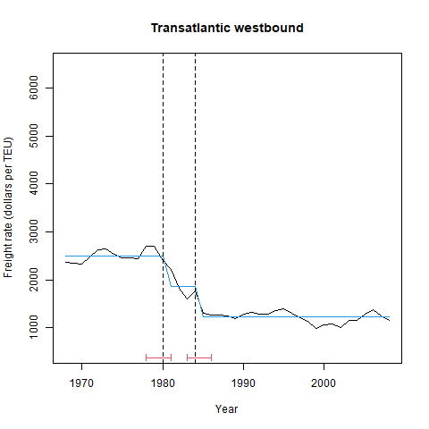
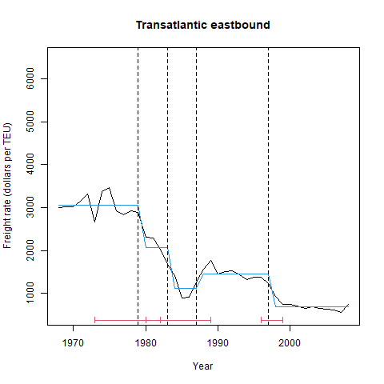
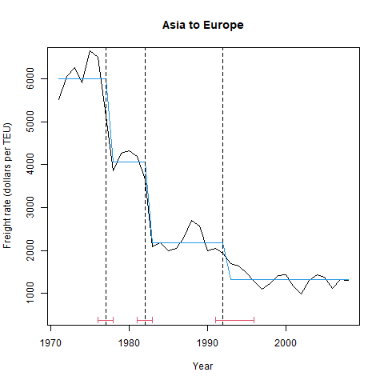

```{r setup, include=FALSE}
knitr::opts_chunk$set(echo = TRUE)
```

# Load data

```{r,echo=FALSE,results = 'asis'}
knitr::opts_chunk$set(echo = FALSE, message = FALSE, warning = FALSE, cache = FALSE)
rm(list = ls())
#library(strucchange)
library(magrittr)
container_freight_rate_each_route <-
  readRDS(file = "../cleaned/container_freight_rate_each_route.rds")
route_demand_data <-
  readRDS(file = "../output/route_demand_data.rds")
options("modelsummary_format_numeric_latex" = "plain") # for modelsummary output
```


# Estimation {.tabset}

## Structural break tests {.tabset}

### Break years of Transpacific westbound and eastbound

```{r,echo=FALSE,results = 'asis'}
temp_transpacific_westbound <- 
  container_freight_rate_each_route %>% 
  dplyr::filter(route == "transpacific_westbound") %>% 
  dplyr::filter(year >= 1968) %>% 
  dplyr::select(-year,
                -route,
                -liner_freight_rate_CPI_adjusted_1995,
                -liner_freight_rate)
temp_transpacific_westbound <-
  ts(temp_transpacific_westbound, 
         start = 1968,
         end = 2008)
res <- 
  strucchange::breakpoints(temp_transpacific_westbound ~ 1,
                         h = 4)
vcov.ri <- function(x, ...) 
  sandwich::kernHAC(x, kernel = "Quadratic Spectral",
          prewhite = 1, approx = "AR(1)", ...)
## coefficient estimates
#coef(res, breaks = length(res$breakpoints))
## corresponding standard errors
#sapply(vcov(res, breaks = length(res$breakpoints), vcov = vcov.ri), sqrt)
#sapply(vcov(res, breaks = length(res$breakpoints)), sqrt)
## breakpoints and confidence intervals
#confint(res, breaks = length(res$breakpoints), vcov = vcov.ri)

BIC_list <- list()
temp <- summary(res)
BIC_list[[1]] <- temp$RSS[2,]
png('../figuretable/structural_change_transpacific_westbound_before_2008.png')
plot(temp_transpacific_westbound,
     xlab="Year", ylab="Freight rate (dollars per TEU)", 
     main = "Transpacific westbound",
     ylim = c(500,6500))
lines(fitted(res, 
             breaks = length(res$breakpoints)),
      col = 4)
lines(confint(res,
              breaks = length(res$breakpoints),
              vcov = vcov.ri))

# legend("topright",
#        legend=c("BIC = ",
#                 round(min(AIC(res, k = log(res$nobs))),
#                       digits = 2))
#        )
dev.off()

temp_transpacific_eastbound <- 
  container_freight_rate_each_route %>% 
  dplyr::filter(route == "transpacific_eastbound") %>% 
  dplyr::filter(year >= 1968) %>% 
  dplyr::select(-year,
                -route,
                -liner_freight_rate_CPI_adjusted_1995,
                -liner_freight_rate)
temp_transpacific_eastbound <-
  ts(temp_transpacific_eastbound, 
         start = 1968,
         end = 2008)
res <- 
  strucchange::breakpoints(temp_transpacific_eastbound ~ 1,
                         h = 4)
# restore BIC
temp <- summary(res)
BIC_list[[2]] <- temp$RSS[2,]
png('../figuretable/structural_change_transpacific_eastbound_before_2008.png')
plot(temp_transpacific_eastbound,
     xlab="Year", ylab="Freight rate (dollars per TEU)", 
     main = "Transpacific eastbound",
     ylim = c(500,6500))
lines(fitted(res, breaks = length(res$breakpoints)), col = 4)
lines(confint(res, breaks = length(res$breakpoints), vcov = vcov.ri))
dev.off()
```

{#id .class width=150mm}

{#id .class width=150mm}

### Break years of Transatlantic westbound and eastbound

```{r,echo=FALSE,results = 'asis'}
temp_transatlantic_westbound <- 
  container_freight_rate_each_route %>% 
  dplyr::filter(route == "transatlantic_westbound") %>% 
  dplyr::filter(year >= 1968) %>% 
  dplyr::select(-year,
                -route,
                -liner_freight_rate_CPI_adjusted_1995,
                -liner_freight_rate)
temp_transatlantic_westbound <-
  ts(temp_transatlantic_westbound, 
         start = 1968,
         end = 2008)

res <- 
  strucchange::breakpoints(temp_transatlantic_westbound ~ 1,
                         h = 4)
# restore BIC
temp <- summary(res)
BIC_list[[3]] <- temp$RSS[2,]
png('../figuretable/structural_change_transatlantic_westbound_before_2008.png')
plot(temp_transatlantic_westbound,
     xlab="Year", ylab="Freight rate (dollars per TEU)", 
     main = "Transatlantic westbound",
     ylim = c(500,6500))
lines(fitted(res, breaks = length(res$breakpoints)), col = 4)
#lines(confint(res, breaks = length(res$breakpoints), vcov = vcov.ri))
lines(confint(res, breaks = length(res$breakpoints)))
dev.off()


temp_transatlantic_eastbound <- 
  container_freight_rate_each_route %>% 
  dplyr::filter(route == "transatlantic_eastbound") %>% 
  dplyr::filter(year >= 1968) %>% 
  dplyr::select(-year,
                -route,
                -liner_freight_rate_CPI_adjusted_1995,
                -liner_freight_rate)
temp_transatlantic_eastbound <-
  ts(temp_transatlantic_eastbound, 
         start = 1968,
         end = 2008)
res <- 
  strucchange::breakpoints(temp_transatlantic_eastbound ~ 1,
                         h = 4)
# restore BIC
temp <- summary(res)
BIC_list[[4]] <- temp$RSS[2,]
png('../figuretable/structural_change_transatlantic_eastbound_before_2008.png')
plot(temp_transatlantic_eastbound,
     xlab="Year", ylab="Freight rate (dollars per TEU)", 
     main = "Transatlantic eastbound",
     ylim = c(500,6500))
lines(fitted(res, breaks = length(res$breakpoints)), col = 4)
lines(confint(res, breaks = length(res$breakpoints), vcov = vcov.ri))
dev.off()
```

{#id .class width=150mm}

{#id .class width=150mm}

### Break years of Asia-Europe and Europe-Asia

```{r,echo=FALSE,results = 'asis'}
temp_asia_to_europe <- 
  container_freight_rate_each_route %>% 
  dplyr::filter(route == "asia_to_europe") %>% 
  dplyr::filter(year >= 1971) %>% 
  dplyr::select(-year,
                -route,
                -liner_freight_rate_CPI_adjusted_1995,
                -liner_freight_rate)
temp_asia_to_europe <-
  ts(temp_asia_to_europe, 
         start = 1971,
         end = 2008)

res <- 
  strucchange::breakpoints(temp_asia_to_europe ~ 1,
                         h = 4)
# restore BIC
temp <- summary(res)
BIC_list[[5]] <- temp$RSS[2,]
png('../figuretable/structural_change_asia_to_europe_before_2008.png')
plot(temp_asia_to_europe,
     xlab="Year", ylab="Freight rate (dollars per TEU)", 
     main = "Asia to Europe",
     ylim = c(500,6500))
lines(fitted(res, breaks = length(res$breakpoints)), col = 4)
lines(confint(res, breaks = length(res$breakpoints), vcov = vcov.ri))
dev.off()


temp_europe_to_asia <- 
  container_freight_rate_each_route %>% 
  dplyr::filter(route == "europe_to_asia") %>% 
  dplyr::filter(year >= 1971) %>% 
  dplyr::select(-year,
                -route,
                -liner_freight_rate_CPI_adjusted_1995,
                -liner_freight_rate) 
  
temp_europe_to_asia <-
  ts(temp_europe_to_asia, 
         start = 1971,
         end = 2008)
res <- 
  strucchange::breakpoints(temp_europe_to_asia ~ 1,
                         h = 4)
# restore BIC
temp <- summary(res)
BIC_list[[6]] <- temp$RSS[2,]
png('../figuretable/structural_change_europe_to_asia_before_2008.png')
plot(temp_europe_to_asia,
     xlab="Year", ylab="Freight rate (dollars per TEU)", 
     main = "Europe to Asia",
     ylim = c(500,6500))
lines(fitted(res, breaks = length(res$breakpoints)), col = 4)
lines(confint(res, breaks = length(res$breakpoints), vcov = vcov.ri))
dev.off()
```

{#id .class width=150mm}


{#id .class width=150mm}


### Output BIC


```{r,echo=FALSE,results = 'asis'}
BIC_list_for_output <- 
  round(
    rbind(as.numeric(BIC_list[[3]]),
      as.numeric(BIC_list[[4]]),
      as.numeric(BIC_list[[1]]),
      as.numeric(BIC_list[[2]]),
      as.numeric(c(BIC_list[[5]]," ")),
      as.numeric(c(BIC_list[[6]]," "))),
      digits = 2)
model_name <-
  c("Transatlantic westbound",
    "Transatlantic eastbound",
    "Transpacific westbound",
    "Transpacific eastbound",
    "Asia to Europe",
    "Europe to Asia")
rownames(BIC_list_for_output) <-
  model_name
colnames(BIC_list_for_output) <-
  c("BIC ($m$ = 0)", 1:9)
BIC_list_for_output[5:6,10] <-
  "-"
BIC_list_for_output <-
  BIC_list_for_output[,1:9]

saveRDS(BIC_list_for_output,
        file = "../output/BIC_list_for_output.rds")

BIC_list_for_output %>% 
  kableExtra::kable() %>% 
  kableExtra::kable_styling()
```
