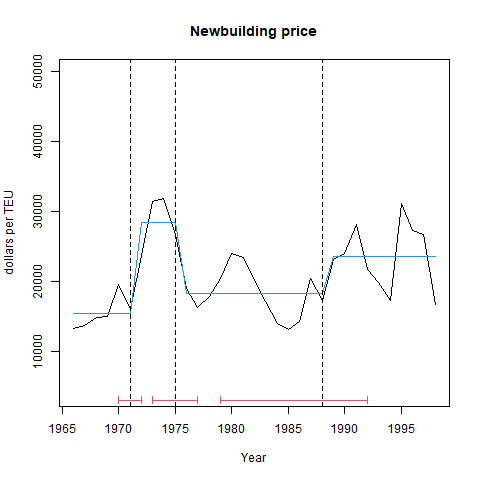
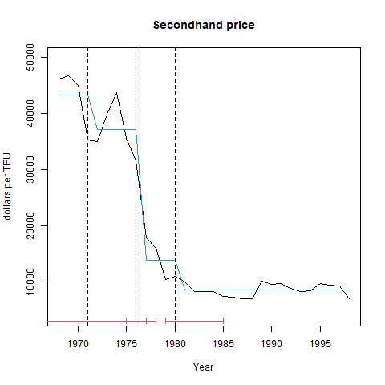

```{r setup, include=FALSE}
knitr::opts_chunk$set(echo = TRUE)
```

# Load data

```{r,echo=FALSE,results = 'asis'}
knitr::opts_chunk$set(echo = FALSE, message = FALSE, warning = FALSE, cache = FALSE)
rm(list = ls())
#library(strucchange)
library(magrittr)
price_newbuilding_secondhand_scrap <-
  readRDS("../cleaned/price_newbuilding_secondhand_scrap.rds") %>%
  tidyr::tibble()
options("modelsummary_format_numeric_latex" = "plain") # for modelsummary output
unique(price_newbuilding_secondhand_scrap$converted_unit)
unique(price_newbuilding_secondhand_scrap$year)
```


# Estimation {.tabset}

## Structural break tests {.tabset}

### Break years of newbuilding price

```{r,echo=FALSE,results = 'asis'}
temp <- 
  price_newbuilding_secondhand_scrap %>% 
  dplyr::filter(converted_unit == "newbuilding_price_per_TEU") %>% 
  dplyr::filter(year >= 1966) %>% 
  dplyr::select(converted_price_cpi_adjusted)
temp <-
  ts(temp, 
     start = 1966,
     end = 1998)
res <- 
  strucchange::breakpoints(temp ~ 1,
                         h = 4)
vcov.ri <- function(x, ...) 
  sandwich::kernHAC(x, kernel = "Quadratic Spectral",
          prewhite = 1, approx = "AR(1)", ...)
## coefficient estimates
#coef(res, breaks = length(res$breakpoints))
## corresponding standard errors
#sapply(vcov(res, breaks = length(res$breakpoints), vcov = vcov.ri), sqrt)
#sapply(vcov(res, breaks = length(res$breakpoints)), sqrt)
## breakpoints and confidence intervals
#confint(res, breaks = length(res$breakpoints), vcov = vcov.ri)

BIC_list <- list()
temp_res <- summary(res)
BIC_list[[1]] <- temp_res$RSS[2,]
png('../figuretable/structural_change_newbuilding_price_before_1998.png')
plot(temp,
     xlab="Year",
     ylab="dollars per TEU", 
     main = "Newbuilding price",
     ylim = c(4000,50000))
lines(fitted(res, 
             breaks = length(res$breakpoints)),
      col = 4)
lines(confint(res,
              breaks = length(res$breakpoints)))
# legend("topright",
#        legend=c("BIC = ",
#                 round(min(AIC(res, k = log(res$nobs))),
#                       digits = 2))
#        )
dev.off()
```

{#id .class width=150mm}

### Break years of secondhand price

```{r,echo=FALSE,results = 'asis'}
temp <- 
  price_newbuilding_secondhand_scrap %>% 
  dplyr::filter(converted_unit == 
                  "second_hand_dry_cargo_price_per_TEU_5years") %>% 
  dplyr::filter(year >= 1968) %>% 
  dplyr::select(converted_price_cpi_adjusted)
temp <-
  ts(temp, 
     start = 1968,
     end = 1998)

res <- 
  strucchange::breakpoints(temp ~ 1,
                           h = 4)
# restore BIC
temp_res <- summary(res)
BIC_list[[2]] <- temp_res$RSS[2,]
png('../figuretable/structural_change_secondhand_price_before_1998.png')
plot(temp,
     xlab="Year", ylab="dollars per TEU", 
     main = "Secondhand price",
     ylim = c(4000,50000))
lines(fitted(res, breaks = length(res$breakpoints)), col = 4)
lines(confint(res, breaks = length(res$breakpoints)))
dev.off()
```

{#id .class width=150mm}


### Break years of scrap price

```{r,echo=FALSE,results = 'asis'}
temp <- 
  price_newbuilding_secondhand_scrap %>% 
  dplyr::filter(converted_unit == 
                  "breaking_price_per_TEU_far_east") %>% 
  dplyr::filter(year >= 1966) %>% 
  dplyr::select(converted_price_cpi_adjusted)
temp <-
  ts(temp, 
         start = 1966,
         end = 1998)

res <- 
  strucchange::breakpoints(temp ~ 1,
                         h = 4)
# restore BIC
temp_res <- summary(res)
BIC_list[[3]] <- temp_res$RSS[2,]
png('../figuretable/structural_change_scrap_price_before_1998.png')
plot(temp,
     xlab="Year", ylab="dollars per TEU", 
     main = "Scrap price",
     ylim = c(100,1500))
lines(fitted(res, 
             breaks = length(res$breakpoints)),
      col = 4)
lines(confint(res,
              breaks = length(res$breakpoints)))
dev.off()

```

{#id .class width=150mm}


### Output BIC


```{r,echo=FALSE,results = 'asis'}
BIC_list_for_output <- 
  round(
    rbind(as.numeric(BIC_list[[1]]),
      as.numeric(c(BIC_list[[2]], " ")),
      as.numeric(BIC_list[[3]])
      ),
      digits = 2)
model_name <-
  c("Newbuilding",
    "Secondhand",
    "Scrap")
rownames(BIC_list_for_output) <-
  model_name
colnames(BIC_list_for_output) <-
  c("BIC ($m$ = 0)", 1:7)
BIC_list_for_output[2,8] <-
  "-"
BIC_list_price_newbuilding_secondhand_scrap_for_output <-
  BIC_list_for_output
saveRDS(BIC_list_price_newbuilding_secondhand_scrap_for_output,
        file = "../output/BIC_list_price_newbuilding_secondhand_scrap_for_output.rds")
```

