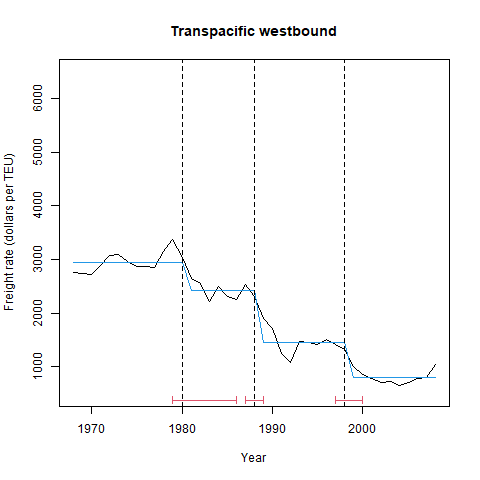
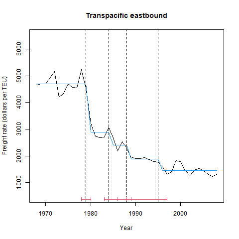
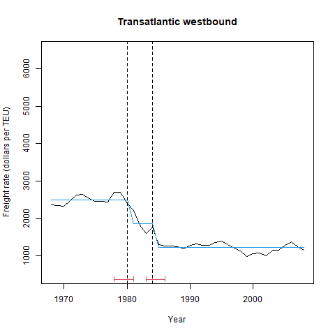
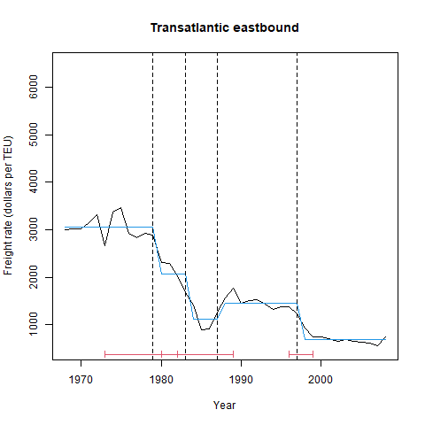
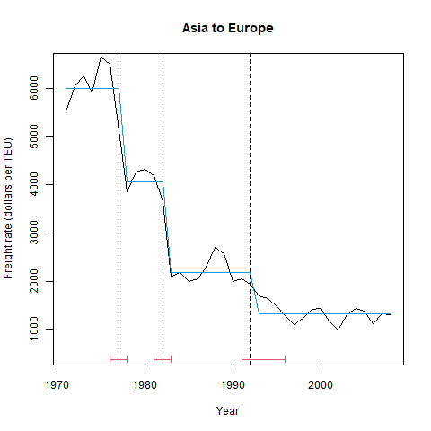
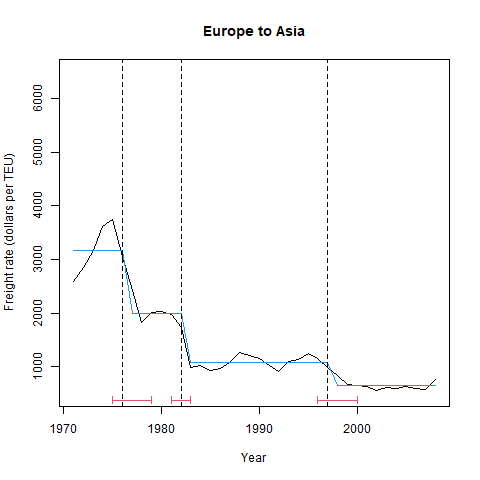

```{r setup, include=FALSE}
knitr::opts_chunk$set(echo = TRUE)
```

```{r, include=FALSE}
knitr::opts_chunk$set(echo = FALSE, message = FALSE, warning = FALSE, cache = FALSE)
rm(list = ls())
library(ggplot2)
library(magrittr)
library(modelsummary)
options(modelsummary_format_numeric_latex = "plain") # for modelsummary output
```

# Load data

```{r,echo=FALSE,results = 'asis'}
route_demand_data <-
  readRDS(file = "../output/route_demand_data.rds")
price_newbuilding_secondhand_scrap <-
  readRDS("../cleaned/price_newbuilding_secondhand_scrap.rds") %>%
  tidyr::tibble()
BIC_list_for_output <-
  readRDS(file = "../output/BIC_list_for_output.rds")
BIC_list_price_newbuilding_secondhand_scrap_for_output <-
  readRDS(file = "../output/BIC_list_price_newbuilding_secondhand_scrap_for_output.rds")
price_newbuilding_secondhand_scrap <-
  price_newbuilding_secondhand_scrap %>% 
  dplyr::mutate(
    converted_unit = ifelse(
      converted_unit == 
        "newbuilding_price_per_TEU",
      "newbuilding",
      ifelse(
        converted_unit == 
          "second_hand_dry_cargo_price_per_TEU_5years",
        "secondhand",
        "scrap")
    )
  ) %>% 
  dplyr::filter(year >= 1966)
```


# Data summary {.tabset}

## Route level data {.tabset}

### Figure 1: Route-level price trend between 1966 and 2007

```{r,echo=FALSE,results = 'asis'}
x <- ggplot(route_demand_data,
            aes(x = year, y = p_dollars_per_TEU)) + 
  geom_line(aes(color = route), alpha = 0.6, size = 1.0) +
  geom_point(aes(shape = route, color = route)) +
  theme_classic() + 
  scale_color_viridis_d() +
  theme(legend.position = 'top',
        legend.text = element_text(size=8)) +
  #ggtitle("Freight rate (CPI adjusted to 1995)") +
  theme(plot.title = element_text(hjust = 0.5)) +
  xlab("Year") + 
  ylab("Shipping price (dollars per TEU)") +
  labs(colour = "", fill = "", shape = "") +
  #expand_limits(y=0, x=2000) + 
  geom_vline(xintercept = 1966, linetype = "longdash") + 
  geom_vline(xintercept = 1980, linetype = "longdash") + 
  annotate("text", x = 1980, y = 5500, size = 1,
           label = "Sea-Land withdrawal\nof cartels") +
  geom_vline(xintercept = 1984, linetype = "longdash") + 
  annotate("text", x = 1984, y = 5000, size = 1,
           label = "The Shipping Act of\n1984 in U.S. enacted")
x
figure_name <- "../figuretable/container_freight_rate_each_route.png"
ggsave(filename = figure_name,
       plot = x,
       device = "png",
       width = 4,
       height = 3)
```


### Figure 2: Route-level shipping quantity trend between 1966 and 2007

```{r,echo=FALSE,results = 'asis'}
x <- ggplot(route_demand_data,
            aes(x = year, y = q_TEU1000)) + 
  geom_line(aes(color = route), alpha = 0.6, size = 1.0) +
  geom_point(aes(shape = route, color = route)) +
  #geom_point(aes(shape = route, color = route)) +
  theme_classic() +
  scale_color_viridis_d() +
  theme(legend.position = 'top',
        legend.text = element_text(size=8)) +
  #ggtitle("Container shipping quantity (1000 TEU)") +
  theme(plot.title = element_text(hjust = 0.5)) +
  xlab("Year") + 
  ylab("Shipping quantity (1000 TEU)") +
  labs(colour = "", fill = "", shape = "") +
  #expand_limits(y=0, x=2000) + 
  geom_vline(xintercept = 1966, linetype = "longdash") + 
  geom_vline(xintercept = 1980, linetype = "longdash") + 
  annotate("text", x = 1980, y = 7000, size = 1,
           label = "Sea-Land withdrawal\nof cartels") +
  geom_vline(xintercept = 1984, linetype = "longdash") + 
  annotate("text", x = 1984, y = 5000, size = 1, 
           label = "The Shipping Act of\n1984 in U.S. enacted")
x
figure_name <- 
  "../figuretable/container_shipping_quantity_each_route.png"
ggsave(filename = figure_name,
       plot = x,
       device = "png",
       width = 4,
       height = 3)
```


### Figure 3: Industry-level variables trend between 1966 and 2007

```{r,echo=FALSE,results = 'asis'}
x <- ggplot(price_newbuilding_secondhand_scrap,
            aes(x = year, 
                y = converted_price_cpi_adjusted)) + 
  geom_line(aes(color = converted_unit),
            alpha = 0.6, size = 1.0) +
  geom_point(aes(shape = converted_unit,
                 color = converted_unit)) +
  theme_classic() + 
  scale_color_viridis_d() +
  theme(legend.position = 'top',
        legend.text = element_text(size=8)) +
  labs(colour = "", fill = "", shape = "") +
  #ggtitle("Freight rate (CPI adjusted to 1995)") +
  theme(plot.title = element_text(hjust = 0.5)) +
  xlab("Year") + 
  ylab("dollars per TEU") +
  geom_vline(xintercept = 1966, linetype = "longdash") + 
  geom_vline(xintercept = 1980, linetype = "longdash") + 
  geom_vline(xintercept = 1984, linetype = "longdash") 
x
figure_name <- "../figuretable/price_newbuilding_secondhand_scrap.png"
ggsave(filename = figure_name,
       plot = x,
       device = "png",
       width = 4,
       height = 3)
```


### Table 1: Summary statistics of route-level variables between 1966 and 2007

```{r,echo=FALSE,results = 'asis'}
## add p and q
route_demand_data_for_output <-
  route_demand_data %>% 
  dplyr::mutate(
    `Price (\\$ per TEU): $P_{rt}$` =
      p_dollars_per_TEU,
    `Quantity (1 mil TEU): $Q_{rt}$` = 
      (q_TEU1000*1000)/1000000) 
f <- 
  (`Price (\\$ per TEU): $P_{rt}$` +
     `Quantity (1 mil TEU): $Q_{rt}$`) ~ 
  N + (mean + sd + min + max)*Arguments(na.rm = TRUE)
route_demand_data_for_output %>% 
  modelsummary::datasummary(
    f,
    escape = FALSE,
    data = .,
    output = "latex_tabular"
  ) %>% 
  gsub("\\multicolumn.*\\\\", "", .) %>% 
  kableExtra::save_kable(
    file = here::here("figuretable/summary_statistics_of_routes_before_2008.tex")
  )
modelsummary::datasummary(
  f,
  data = route_demand_data_for_output)
```


### Table 2: Summary statistics of industry-level variables between 1966 and 2007

```{r,echo=FALSE,results = 'asis'}
## add p and q
price_newbuilding_secondhand_scrap_for_output <-
  price_newbuilding_secondhand_scrap %>%
  tidyr::pivot_wider(names_from = converted_unit,
              values_from = converted_price_cpi_adjusted) %>% 
  dplyr::mutate(
    `Newbuilding price (\\$ per TEU): $P_{t}^{new}$` =
      newbuilding,
    `Secondhand price (\\$ per TEU): $P_{t}^{second}$` =
      secondhand,
    `Scrap price (\\$ per TEU): $P_{t}^{scrap}$` =
      scrap)
f <-
  (`Newbuilding price (\\$ per TEU): $P_{t}^{new}$` +
     `Secondhand price (\\$ per TEU): $P_{t}^{second}$` +
     `Scrap price (\\$ per TEU): $P_{t}^{scrap}$`) ~
  N + (mean + sd + min + max)*Arguments(na.rm = TRUE)
price_newbuilding_secondhand_scrap_for_output %>%
  modelsummary::datasummary(
    f,
    escape = FALSE,
    data = .,
    output = "latex_tabular"
  ) %>%
  gsub("\\multicolumn.*\\\\", "", .) %>%
  kableExtra::save_kable(
    file = here::here("figuretable/summary_statistics_of_industry_before_1998.tex")
  )
modelsummary::datasummary(
  f,
  data = price_newbuilding_secondhand_scrap_for_output)
```


## Estimation results {.tabset}

### Figure 4: The estimated break points and 95 \% confidence intervals with BIC.

{#id .class width=150mm}

{#id .class width=150mm}


{#id .class width=150mm}

{#id .class width=150mm}


{#id .class width=150mm}


{#id .class width=150mm}

```{r,echo=FALSE,results = 'asis'}
BIC_list_for_output %>% 
  kableExtra::kable() %>% 
  kableExtra::kable_styling()
BIC_list_for_output %>% 
  kableExtra::kbl(
    format = "latex",
    booktabs = TRUE,
    escape = FALSE
  ) %>% 
  kableExtra::save_kable(
    file = here::here("figuretable/BIC_results.tex")
  )

BIC_list_price_newbuilding_secondhand_scrap_for_output %>% 
  kableExtra::kbl(
    format = "latex",
    booktabs = TRUE,
    escape = FALSE
  ) %>% 
  kableExtra::save_kable(
    file = here::here("figuretable/BIC_results_price_newbuilding_secondhand_scrap.tex")
  )
BIC_list_price_newbuilding_secondhand_scrap_for_output %>% 
  kableExtra::kable() %>% 
  kableExtra::kable_styling()
```
